# TradeX Advanced Features Specification

**Version:** 2.0  
**Status:** Draft  
**Author:** Enhancement Documentation  
**Date:** 2026-01-31

---

## Executive Summary

Dokumen ini melengkapi PRD.md dan Architecture-Blueprint.md dengan 14 modul fitur advanced untuk mentransformasi TradeX menjadi trading super app yang komprehensif, mendukung jutaan user concurrent dengan latency rendah dan keamanan tingkat enterprise.

---

## 1. AI Market Prediction Module

### 1.1 Overview

Modul prediksi berbasis Machine Learning untuk menganalisis dan meramalkan pergerakan harga saham, emas, dan kripto.

### 1.2 Data Sources

| Source Type          | Provider Examples            | Data Points                    |
| -------------------- | ---------------------------- | ------------------------------ |
| Historical Price     | Yahoo Finance, Alpha Vantage | OHLCV, Volume Profile          |
| Social Sentiment     | Twitter/X API, Reddit API    | Mention Count, Sentiment Score |
| Technical Indicators | Internal Calculation         | RSI, MACD, Bollinger Bands, MA |
| Fundamental Data     | Financial Modeling Prep      | P/E, EPS, Revenue Growth       |
| News & Events        | NewsAPI, Bloomberg           | Headlines, Economic Calendar   |

### 1.3 ML Pipeline Architecture

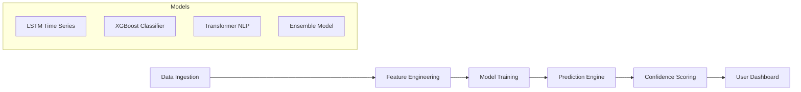

### 1.4 Prediction Output

- **Price Direction**: Up/Down/Sideways dengan confidence level (0-100%)
- **Target Price Range**: Min-Max estimate untuk 1D, 1W, 1M
- **Risk Assessment**: Low/Medium/High volatility forecast
- **Signal Strength**: Strong Buy / Buy / Hold / Sell / Strong Sell

### 1.5 Technology Stack

- **ML Framework**: Python (TensorFlow, PyTorch, scikit-learn)
- **Feature Store**: Feast / Redis
- **Model Serving**: TensorFlow Serving / TorchServe
- **Orchestration**: Apache Airflow / Prefect

---

## 2. Real-Time Market Analysis System

### 2.1 Auto-Scanning Engine

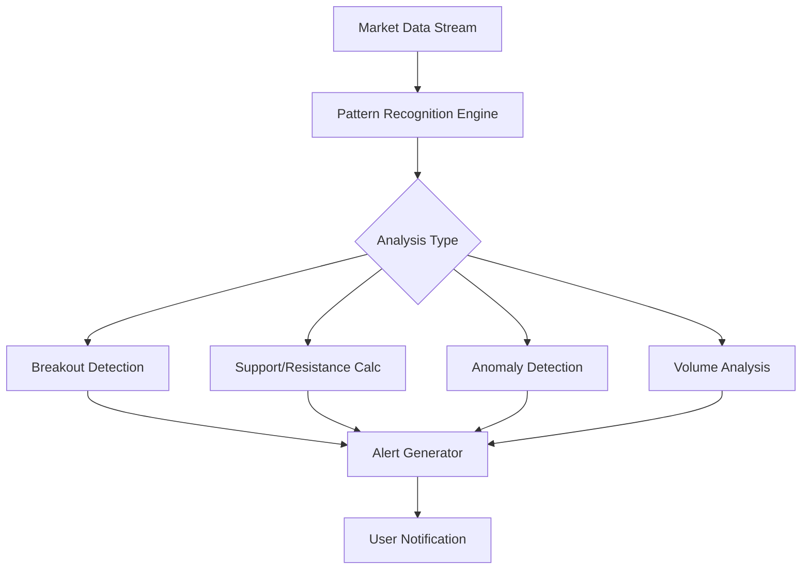

### 2.2 Detection Capabilities

| Feature            | Description                  | Algorithm                  |
| ------------------ | ---------------------------- | -------------------------- |
| Breakout Patterns  | Cup & Handle, Triangle, Flag | Pattern Matching + ML      |
| Support/Resistance | Dynamic S/R levels           | Pivot Points, Fibonacci    |
| Price Anomalies    | Unusual price movements      | Z-Score, Isolation Forest  |
| Volume Spikes      | Abnormal volume detection    | Statistical Analysis       |
| Gap Analysis       | Opening gaps detection       | Pre/Post market comparison |

### 2.3 Scanning Parameters

- **Frequency**: Real-time (sub-second) untuk major assets
- **Coverage**: All listed stocks, top 100 crypto, commodities
- **Customization**: User-defined scan criteria

---

## 3. Personal Recommendation Engine

### 3.1 User Profile Components

```yaml
UserProfile:
  RiskTolerance: [Conservative, Moderate, Aggressive]
  InvestmentHorizon: [Short-term, Medium-term, Long-term]
  PreferredSectors: [Technology, Healthcare, Energy, ...]
  TradingStyle: [Day Trading, Swing, Position, Value]
  PortfolioSize: [Small, Medium, Large]
  ExperienceLevel: [Beginner, Intermediate, Advanced]
```

### 3.2 Recommendation Algorithm

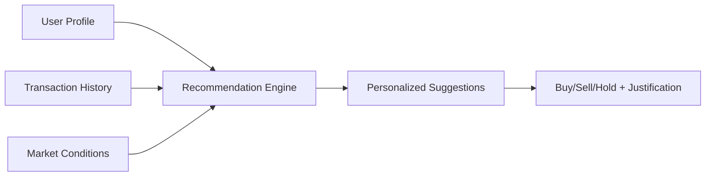

### 3.3 Output Format

```json
{
  "symbol": "BBCA",
  "recommendation": "BUY",
  "confidence": 78,
  "justification": [
    "Technical: Price above 50-day MA with strong RSI",
    "Fundamental: Q3 earnings beat expectations by 12%",
    "Risk Profile: Matches your moderate risk tolerance"
  ],
  "targetPrice": 9500,
  "stopLoss": 8800,
  "timeframe": "2-4 weeks"
}
```

---

## 4. Portfolio Management System

### 4.1 Core Features

#### Automatic Rebalancing

- **Threshold-based**: Rebalance when allocation drifts >5%
- **Calendar-based**: Monthly/Quarterly rebalancing
- **Tax-aware**: Minimize tax impact during rebalancing

#### Tax-Loss Harvesting

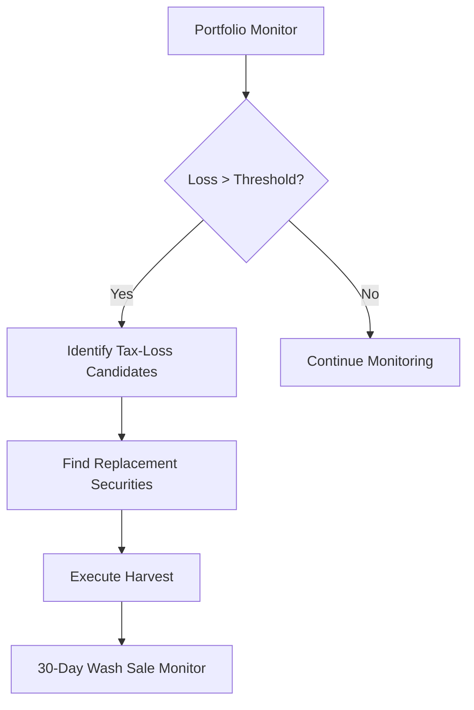

#### Diversification Engine

- **Asset Class**: Stocks, Bonds, Commodities, Crypto
- **Geographic**: Domestic, Developed, Emerging Markets
- **Sector**: Technology, Healthcare, Finance, etc.
- **Correlation Analysis**: Minimize correlated holdings

### 4.2 Performance Tracking

| Metric       | Description                     |
| ------------ | ------------------------------- |
| Total Return | Absolute portfolio return       |
| Alpha        | Excess return vs benchmark      |
| Beta         | Portfolio volatility vs market  |
| Sharpe Ratio | Risk-adjusted return            |
| Max Drawdown | Largest peak-to-trough decline  |
| Win Rate     | Percentage of profitable trades |

---

## 5. Social Trading Platform

### 5.1 Features Overview

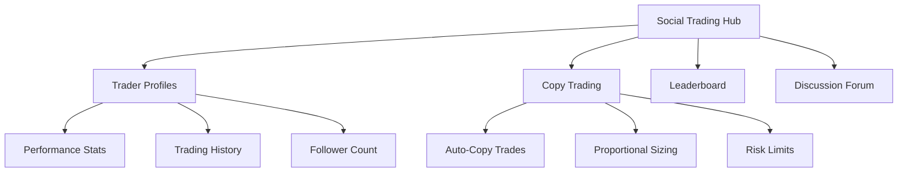

### 5.2 Copy Trading Mechanics

```yaml
CopyTradeSettings:
  MaxAllocation: 20% # Max % of portfolio per copied trader
  MaxSlippage: 0.5% # Cancel if price moves too much
  RiskMultiplier: 0.5-2.0 # Scale position sizes
  StopCopying:
    DrawdownLimit: 15%
    LossLimit: $1000
```

### 5.3 Leaderboard Criteria

- **Returns**: 30D, 90D, 1Y performance
- **Risk-Adjusted**: Sharpe Ratio ranking
- **Consistency**: Win rate, max drawdown
- **Follower Growth**: Popularity metrics
- **Verification**: Verified traders badge

---

## 6. News Aggregator & Sentiment Analysis

### 6.1 Data Pipeline

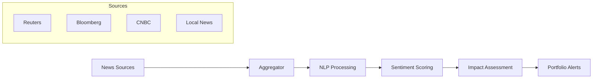

### 6.2 Sentiment Analysis Output

| Field     | Values       | Description                 |
| --------- | ------------ | --------------------------- |
| Sentiment | -1 to +1     | Negative to Positive        |
| Relevance | 0-100%       | Relevance to user portfolio |
| Impact    | Low/Med/High | Potential market impact     |
| Urgency   | 1-5          | Time sensitivity            |

### 6.3 Portfolio Impact Assessment

- Real-time correlation dengan holdings
- Sector-level impact analysis
- Historical similar event outcomes
- Recommended actions

---

## 7. Trading Simulation & Backtesting

### 7.1 Paper Trading

```yaml
VirtualAccount:
  InitialBalance: $100,000 (configurable)
  ResetFrequency: On-demand
  Features:
    - Real-time market data
    - Full order types support
    - Performance tracking
    - Strategy journaling
```

### 7.2 Backtesting Engine

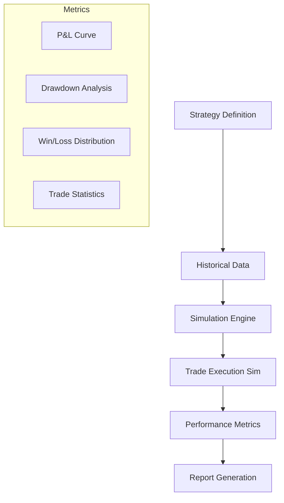

### 7.3 Strategy Builder

- Visual drag-and-drop strategy builder
- Code-based strategy (Python/JavaScript)
- Pre-built strategy templates
- Multi-timeframe analysis

---

## 8. Alert & Notification System

### 8.1 Alert Types

| Category     | Examples                                 |
| ------------ | ---------------------------------------- |
| Price Alerts | Target price reached, % change threshold |
| Technical    | RSI overbought, MA crossover             |
| News         | Breaking news on holdings                |
| Portfolio    | Daily P&L summary, margin warning        |
| AI Insights  | New prediction, signal change            |
| Social       | Copied trader action, discussion reply   |

### 8.2 Delivery Channels

- **In-App**: Real-time push notifications
- **Email**: Digest summaries, critical alerts
- **SMS**: High-priority alerts (optional)
- **Telegram/Discord**: Bot integration
- **Webhook**: Custom integrations

### 8.3 Customization Options

```yaml
AlertConfig:
  QuietHours: "22:00-07:00"
  Frequency: Immediate | Digest
  Priority: Low | Medium | High | Critical
  Channels: [Push, Email, SMS]
  Grouping: BySymbol | ByType | None
```

---

## 9. Interactive Education Platform

### 9.1 Content Structure

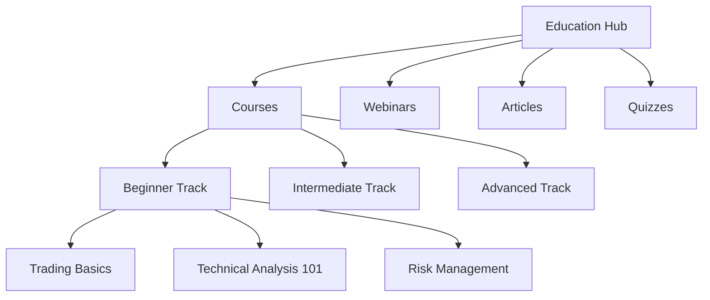

### 9.2 Adaptive Learning

- Skill assessment test at onboarding
- Personalized learning path
- Progress tracking & badges
- Knowledge gaps identification

### 9.3 Expert Content

- Live webinars dengan traders profesional
- Q&A sessions
- Strategy workshops
- Market analysis sessions

---

## 10. Community & Forum

### 10.1 Features

| Feature           | Description                |
| ----------------- | -------------------------- |
| Discussion Boards | Topic-based forums         |
| Trade Ideas       | Share analysis with charts |
| Peer Support      | Q&A system                 |
| User Groups       | Private group discussions  |
| Reputation System | Karma, badges, levels      |

### 10.2 Moderation System

- AI-powered content filtering
- Community moderators
- Report & flag system
- Auto-ban for violations
- Spam detection

---

## 11. Dashboard Analytics

### 11.1 Visualization Components

- Interactive charts (Candlestick, Line, Bar)
- Heat maps for sector performance
- Correlation matrices
- P&L waterfall charts
- Geographic allocation maps

### 11.2 Export Capabilities

- PDF reports with branding
- CSV/Excel data export
- API access for external tools
- Scheduled report delivery

### 11.3 Third-Party Integrations

- TradingView embed
- Google Sheets sync
- Notion integration
- Zapier webhooks

---

## 12. Advanced Order Types

### 12.1 Supported Orders

| Order Type    | Description                           |
| ------------- | ------------------------------------- |
| Market        | Execute at current price              |
| Limit         | Execute at specified price or better  |
| Stop Loss     | Sell when price falls to level        |
| Stop Limit    | Stop + Limit combination              |
| Trailing Stop | Dynamic stop that follows price       |
| OCO           | One-Cancels-Other paired orders       |
| Iceberg       | Large order split into smaller chunks |
| Bracket       | Entry + Target + Stop Loss            |
| TWAP          | Time-weighted average price           |
| VWAP          | Volume-weighted average price         |

### 12.2 Order Flow

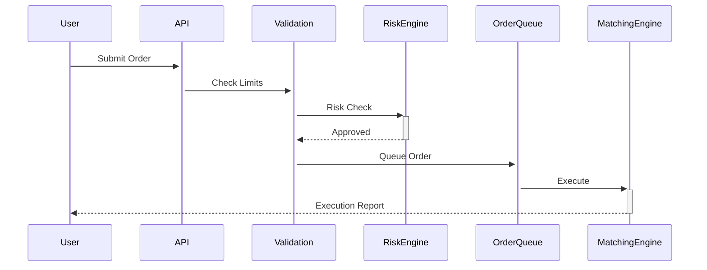

---

## 13. Risk Management System

### 13.1 Calculators

```yaml
PositionSizing:
  AccountSize: $100,000
  RiskPerTrade: 2% # $2,000 max loss
  StopLossDistance: 5%
  PositionSize: $40,000 # Calculated

RiskMetrics:
  VaR_95: $5,230 # 95% confidence max loss
  VaR_99: $7,850
  ExpectedShortfall: $8,200
  MaxDrawdown: 12.5%
```

### 13.2 Portfolio Risk Dashboard

| Metric             | Value | Status    |
| ------------------ | ----- | --------- |
| Portfolio Beta     | 1.2   | ⚠️ High   |
| Sharpe Ratio       | 1.8   | ✅ Good   |
| Sortino Ratio      | 2.1   | ✅ Good   |
| Max Drawdown       | 8%    | ✅ Normal |
| Concentration Risk | 35%   | ⚠️ Review |

### 13.3 Margin Alert System

- Real-time margin level monitoring
- Tiered alerts: 80%, 90%, 95%, 100%
- Auto-liquidation protection settings
- Margin call notifications

---

## 14. Scalability & Infrastructure

### 14.1 Target Specifications

| Requirement      | Target             |
| ---------------- | ------------------ |
| Concurrent Users | 1,000,000+         |
| Order Latency    | <50ms p99          |
| Data Latency     | <100ms market data |
| Uptime           | 99.99%             |
| Data Retention   | 10+ years          |

### 14.2 Enhanced Architecture

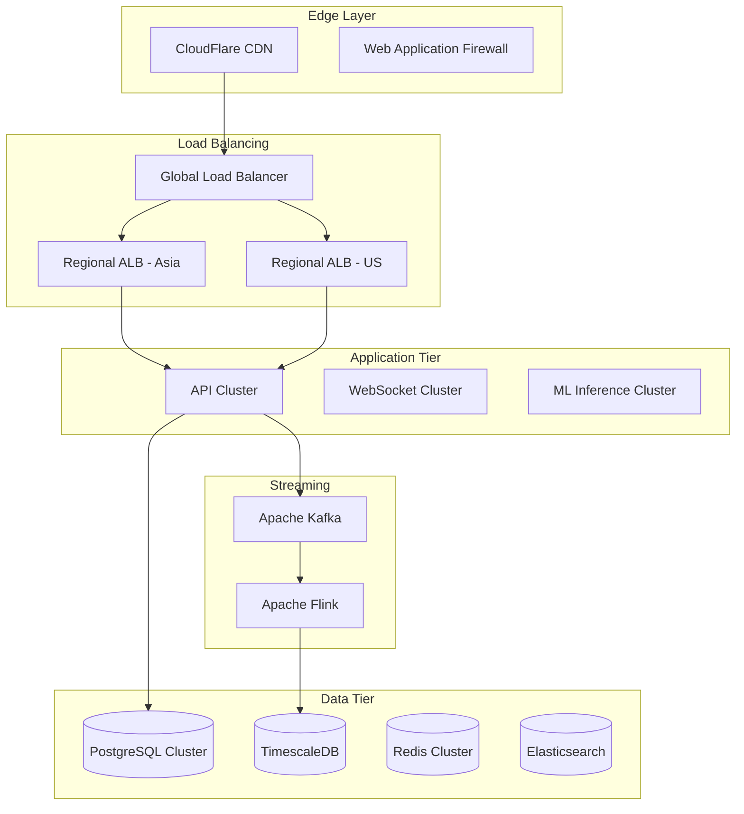

---

## 15. Technology Stack Recommendations

### 15.1 Backend Services

| Component     | Technology              | Justification                     |
| ------------- | ----------------------- | --------------------------------- |
| API Gateway   | Kong / AWS API Gateway  | Rate limiting, auth, routing      |
| Core API      | Laravel 11 + Octane     | Existing stack, high performance  |
| Real-time     | Go / Rust microservices | Ultra-low latency for market data |
| ML Services   | Python FastAPI          | ML ecosystem compatibility        |
| Message Queue | Apache Kafka            | High-throughput event streaming   |
| Cache         | Redis Cluster           | Session, cache, pub/sub           |

### 15.2 Database Strategy

| Use Case      | Database         | Reason                      |
| ------------- | ---------------- | --------------------------- |
| Transactional | PostgreSQL       | ACID, reliability           |
| Time Series   | TimescaleDB      | Optimized for OHLCV data    |
| Search        | Elasticsearch    | Full-text search, analytics |
| Cache         | Redis            | Low-latency reads           |
| ML Features   | Apache Cassandra | High write throughput       |

### 15.3 Frontend

| Component | Technology                |
| --------- | ------------------------- |
| Web App   | Next.js 14 + React        |
| Mobile    | React Native / Flutter    |
| Charts    | TradingView + D3.js       |
| State     | Redux Toolkit + RTK Query |
| Real-time | Socket.io / WebSocket     |

---

## 16. API Integrations

### 16.1 Market Data Providers

| Provider                       | Data Type       | Region    |
| ------------------------------ | --------------- | --------- |
| IDX (Indonesia Stock Exchange) | Stocks          | Indonesia |
| Yahoo Finance API              | Global stocks   | Global    |
| CoinGecko / Binance            | Crypto          | Global    |
| Alpha Vantage                  | Stocks, Forex   | Global    |
| Polygon.io                     | US Stocks       | US        |
| GoldAPI                        | Precious Metals | Global    |

### 16.2 Third-Party Services

| Service         | Purpose                   |
| --------------- | ------------------------- |
| Twilio          | SMS notifications         |
| SendGrid        | Email delivery            |
| Firebase        | Push notifications        |
| Stripe          | Payment processing        |
| AWS Rekognition | KYC document verification |
| OpenAI / Claude | AI-powered insights       |

---

## 17. Security Measures

### 17.1 Security Layers

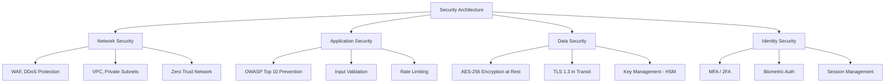

### 17.2 Compliance Requirements

| Standard        | Requirement                     |
| --------------- | ------------------------------- |
| PCI-DSS         | Payment card handling           |
| SOC 2 Type II   | Security controls audit         |
| ISO 27001       | Information security management |
| GDPR            | Data privacy (if EU users)      |
| OJK Regulations | Indonesian financial services   |

### 17.3 Audit & Monitoring

- Real-time security event monitoring (SIEM)
- Automated vulnerability scanning
- Penetration testing (quarterly)
- Audit logging dengan immutable storage
- Incident response playbooks

---

## 18. Compliance Framework

### 18.1 Regulatory Bodies

| Regulator | Jurisdiction | Requirements                  |
| --------- | ------------ | ----------------------------- |
| OJK       | Indonesia    | Securities license, reporting |
| BAPPEBTI  | Indonesia    | Crypto trading license        |
| Kominfo   | Indonesia    | Data localization             |

### 18.2 Required Licenses

- Izin Usaha Perantara Pedagang Efek (PPE)
- Izin Penyelenggara Sistem Elektronik (PSE)
- BAPPEBTI registration untuk crypto

### 18.3 Compliance Features

- KYC/AML automated verification
- Transaction monitoring & reporting
- Suspicious activity detection
- Regulatory reporting automation
- Data retention policies

---

## 19. Implementation Roadmap

### Phase 1: Foundation (Q1-Q2 2026)

- [ ] Enhanced architecture deployment
- [ ] Advanced order types
- [ ] Basic risk management
- [ ] Alert system v1

### Phase 2: Intelligence (Q3-Q4 2026)

- [ ] AI prediction module (beta)
- [ ] Real-time scanning
- [ ] News aggregation
- [ ] Sentiment analysis

### Phase 3: Social & Education (Q1-Q2 2027)

- [ ] Social trading platform
- [ ] Copy trading
- [ ] Education platform
- [ ] Community forums

### Phase 4: Advanced Features (Q3-Q4 2027)

- [ ] Full recommendation engine
- [ ] Portfolio optimization
- [ ] Backtesting platform
- [ ] Third-party integrations

---

## 20. Success Metrics

| Category       | KPI                | Target               |
| -------------- | ------------------ | -------------------- |
| User Growth    | MAU                | 100K in Y1, 1M in Y3 |
| Engagement     | DAU/MAU            | > 40%                |
| Trading Volume | Daily GMV          | $10M in Y1           |
| AI Accuracy    | Prediction success | > 65%                |
| Performance    | Order latency      | < 50ms p99           |
| Reliability    | Uptime             | 99.99%               |
| NPS            | User satisfaction  | > 50                 |

---

## Appendix A: Glossary

| Term         | Definition                             |
| ------------ | -------------------------------------- |
| VaR          | Value at Risk - potential loss measure |
| Sharpe Ratio | Risk-adjusted return metric            |
| OCO          | One-Cancels-Other order type           |
| TWAP         | Time-Weighted Average Price            |
| MAU/DAU      | Monthly/Daily Active Users             |

---

## Appendix B: References

- [TradingView Documentation](https://www.tradingview.com/chart/)
- [Alpaca API](https://alpaca.markets/docs/)
- [OJK Regulations](https://www.ojk.go.id/)
- [OWASP Security Guidelines](https://owasp.org/)

---

_Document End_
